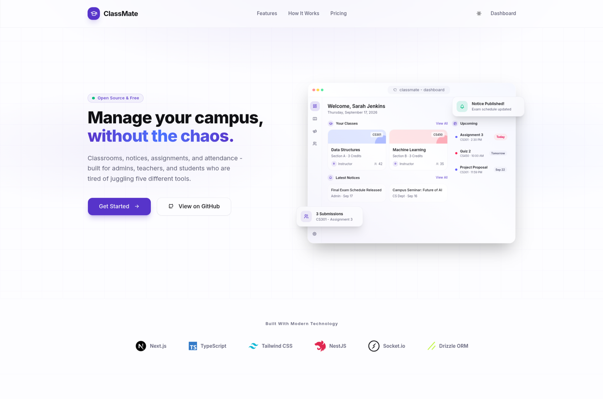
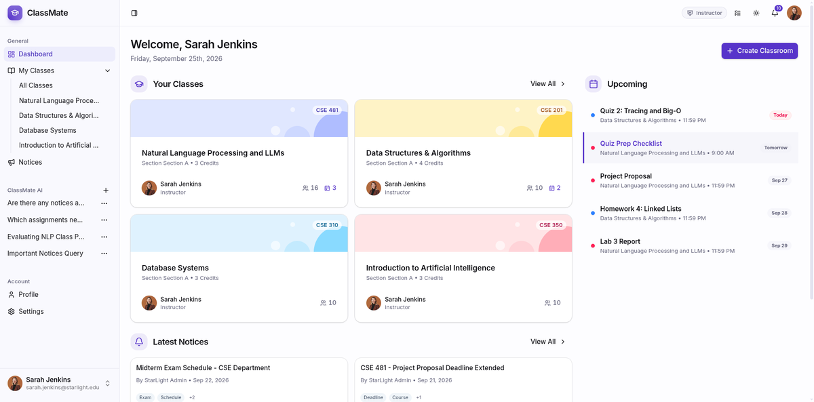
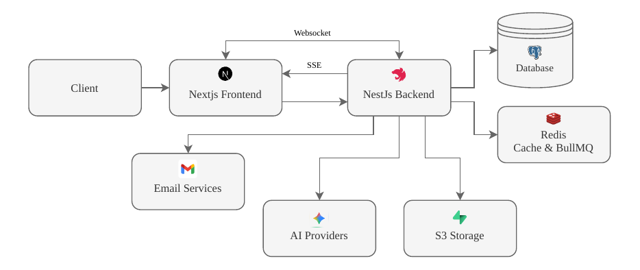

# ClassMate Backend

One place for courses, classrooms, assignments, notices, and an AI assistant that answers from your own materials.


Links: Frontend [ReactiveX22/classmate-client](https://github.com/ReactiveX22/classmate-client) · Swagger `/api`

## Where it started

Classes were spread across WhatsApp, Classroom, and Facebook groups. ClassMate puts them in one place:

* Teaching: organizations, courses, enrollment, classrooms, posts, assignments and grading, attendance
* Admin: directories, course catalog, bulk CSV/Excel import with review, impersonation of any teacher or student in the same org
* Comms: notices, Socket.IO notifications, mail
* AI assistant: streaming chat with RAG over classroom and notice files, plus tools for deadlines, grades, todos, and optional web search, scoped by role and org

## What it looks like in use




## Stack

| Layer | Choice |
|---|---|
| API | NestJS 11, Swagger, Zod validation |
| Data | Postgres + pgvector, Drizzle ORM |
| Queue/cache | Redis, BullMQ, cache-manager |
| AI | LangGraph, LangChain, Gemini Flash with Groq/Ollama fallback, Tavily search |
| Auth | Better-Auth with Argon2id sessions |
| Realtime | Socket.IO rooms |
| Files | S3, MinIO or local storage, SMTP mail |
| Deploy | Docker, GHCR |
| Test | Vitest, Jest |

## How services connect



Next.js handles the UI, NestJS serves `api/v1`, Drizzle talks to Postgres. Redis covers cache and queues. Files go to S3 or MinIO. The LangGraph agent keeps its state in Postgres. The assistant below reads through those same scoped paths.

## AI assistant

When a question needs course context, the chat pulls only from files the user can already see:

* Streaming chat at `POST /api/v1/ai/chat/stream` over SSE (`content|tool|final`) with retry and per-conversation threads (`src/ai/ai.controller.ts`)
* Search runs through pgvector filtered by classroom, org, and role. The agent gets tools, not raw DB access, in a bounded ReAct-inspired model/tools loop.
* Tools cover classroom posts and grades, upcoming deadlines, org notices, RAG over classroom and notice attachments, todo management through a sub-agent, and `web_search` via Tavily when a key is set (`src/ai/tools/main-tools-registry.service.ts`)
* Uploads enqueue BullMQ jobs that chunk (1200/200), embed, and write to pgvector with hash dedup so retries are safe (`src/embedding/`)
* Gemini Flash by default with Groq and Ollama as fallback, temp 0.2, behind the `AI_ENABLED` flag (`src/ai/services/ai-provider.service.ts`)

## Implementation

* 15 modules with controller/service/repository boundaries keep domains apart (`src/app.module.ts`)
* Sessions carry role and org, enforced by `@Roles()` plus org/classroom checks (`src/auth/`, `src/main.ts`)
* Cache keys include org, route, and params, and writes invalidate their own scope (`src/cache/`)
* Slow work leaves the request: embeddings and CSV imports run as jobs, files resolve to local, MinIO, or S3 (`src/import/`, `src/storage/`)
* Live updates go to `class_{id}` and `org_{id}` rooms only, behind throttle, validation, and a Drizzle error filter (`src/notification/`, `src/main.ts`)

## Quickstart

```bash
pnpm install
cp .env.example .env   # set DATABASE_URL and other API keys
pnpm db:push
pnpm dev               # API at http://localhost:3000/api/v1, docs at /api
```

<details>
<summary>More commands</summary>

```bash
pnpm db:studio          # Drizzle Studio GUI
pnpm test               # unit (vitest)
pnpm test:int           # integration (jest)
pnpm build && pnpm start:prod
```

Needs Postgres + Redis. See `.env.example` for `CACHE_STORE`, `QUEUE_REDIS_URL`, `STORAGE_SERVICE`, `AI_PROVIDER`.
</details>

## Why built this way

NestJS modules instead of plain Express to keep 15 domains separated and testable. Postgres with pgvector instead of a separate vector DB so relations and ACL checks stay in SQL. BullMQ async instead of inline so uploads return fast and embeddings can retry.

Pushing to `main` builds and publishes Docker to GHCR.
